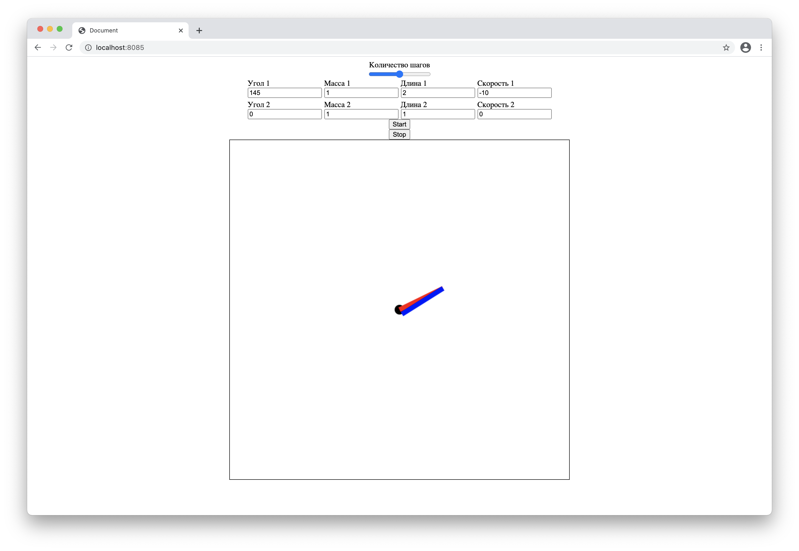

# HttpServer
Простой http сервер для моделирования двойного маятника. Визуализация использует js, имеется динамическое изменение параметров 
моделирования. 

## Setup
- Склонировать репозиторий `git clone --recurse-submodules https://github.com/Jhoysbou/HttpServer.git`
- Сгенерировать Makefile `cmake`
- Скомпилировать исходники `make`
- Запусть приложение `main`
- Страница будет доступна на http://localhost:8085

## Моделирование

Сверху находится ползунок изменения времени моделирования. \
После - поля для ввода параметров.\
Внизу визуализация моделирования двойного маятника.

### Параметры:
- Массы обоих тел
- Длины тел
- Начальных углов между стержнями и вертикалью
- Начальных скоростей тел
